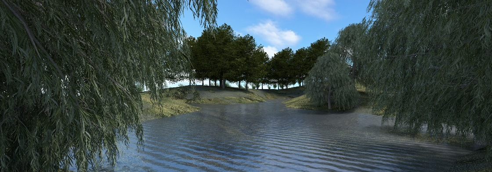

3D visualization of Geospatial data and simulations with Blender
===============

 
    

### [Introduction to Blender interface and scripting basics](https://github.com/ptabriz/geodesign_with_blender/wiki/intro_blender)  

 
    

### [Converting geospatial data and simulations to 3D models : viewscape example](https://github.com/ptabriz/geodesign_with_blender/wiki/viewshed_example)  

 
    

### [Landscape modeling with GIS data](https://github.com/ptabriz/geodesign_with_blender/wiki/landscape_modeling_example)  

 
    

### [Real-time modeling and coupling ](https://github.com/ptabriz/geodesign_with_blender/wiki/realtime)  

 
    

### [Web3DGIS with Blender ](https://github.com/ptabriz/geodesign_with_blender/wiki/web3Dgis)  
